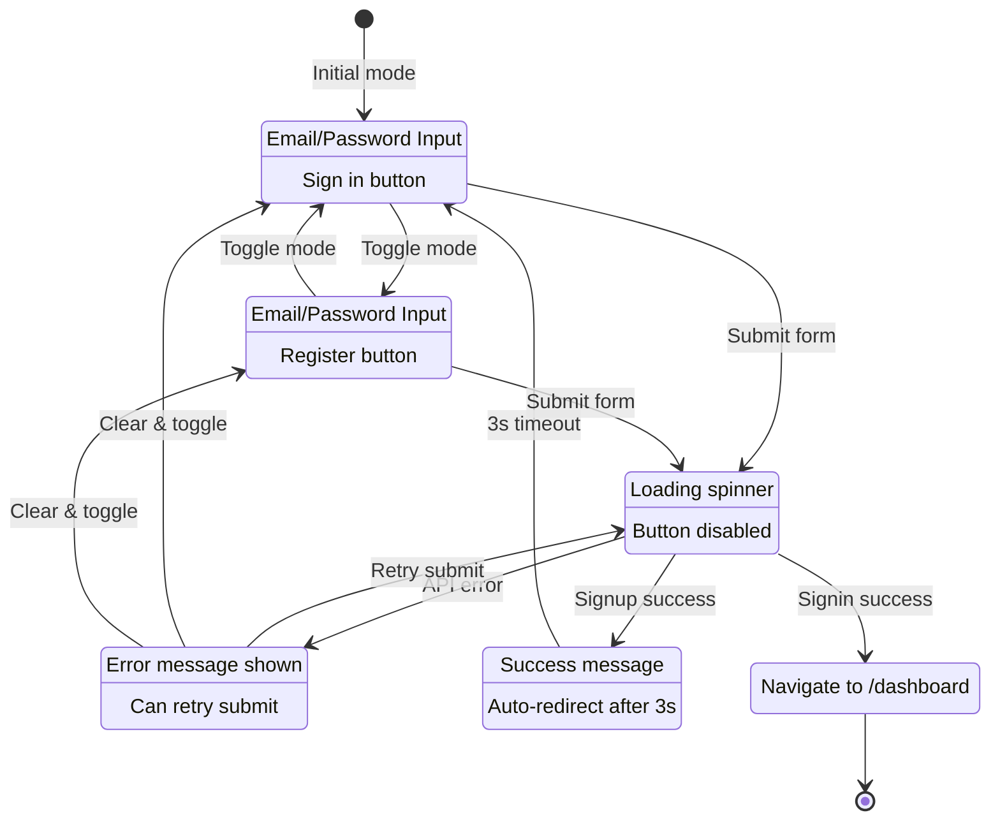
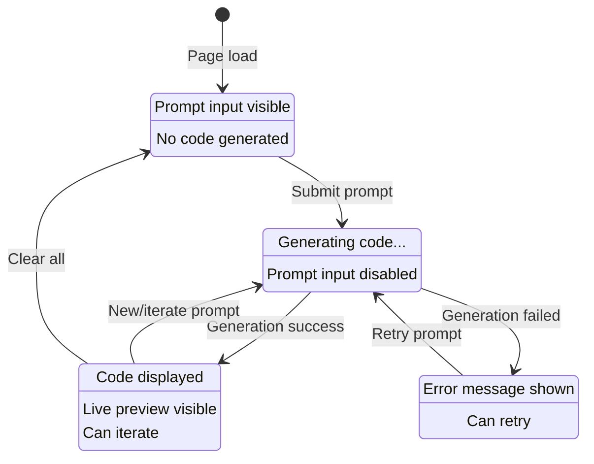
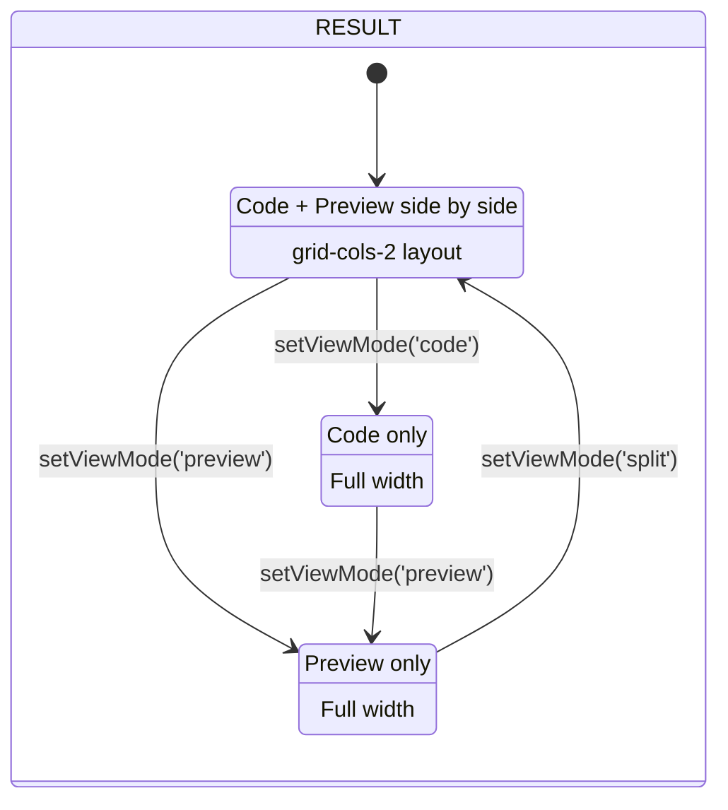
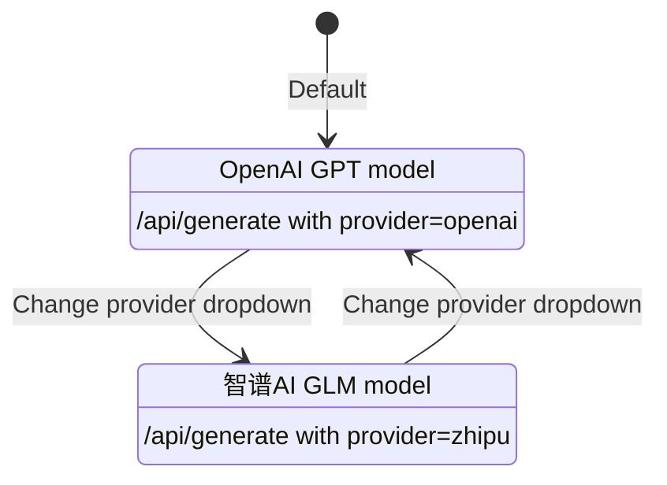
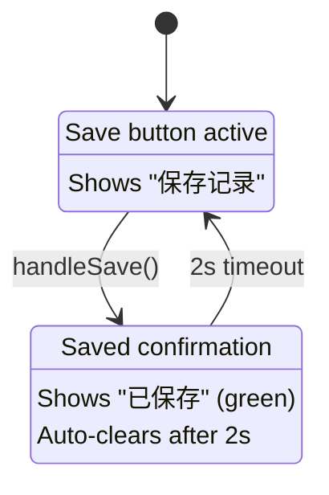
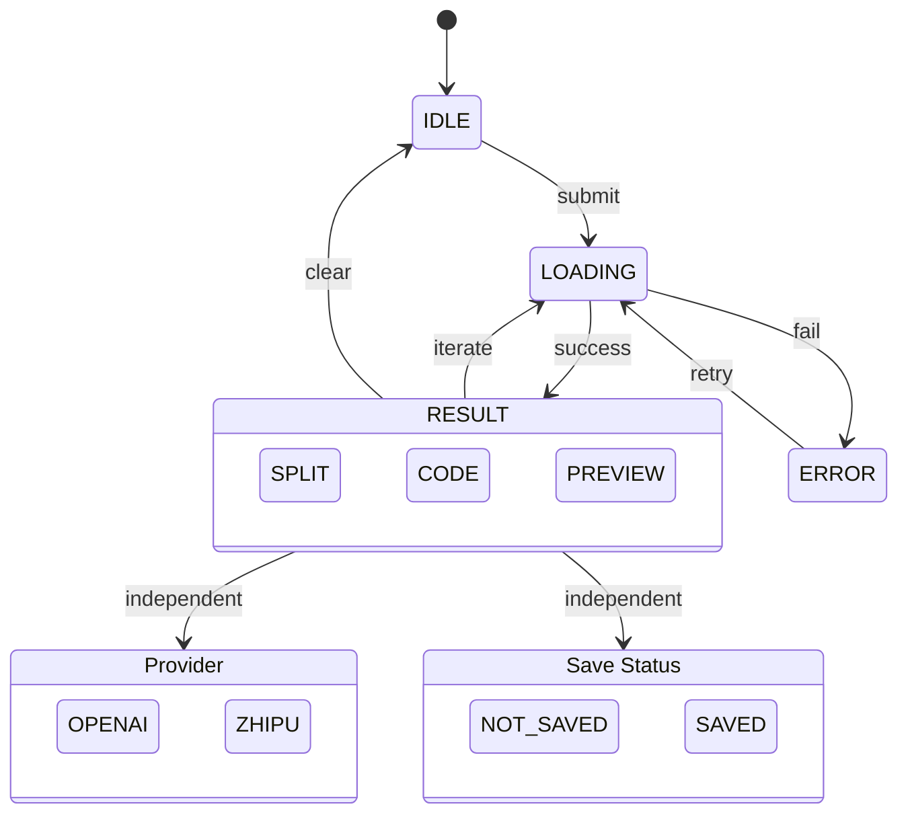

# State Machine Diagrams

This document contains state machine diagrams for components with significant state complexity.

---

## 1. AuthForm State Machine

**Component:** `src/components/AuthForm.tsx`

### State Diagram

### State Table

| State | Description | Data |
|-------|-------------|------|
| `SIGNIN` | Sign-in form mode | email, password |
| `SIGNUP` | Sign-up form mode | email, password |
| `LOADING` | Form submission in progress | loading=true |
| `ERROR` | Error message displayed | error message |
| `SUCCESS` | Signup success, waiting to redirect | success message |
| `REDIRECT` | Signin success, navigating | - |

### Transitions

| From | Event | To |
|------|-------|-----|
| SIGNIN/SIGNUP | Toggle mode | SIGNUP/SIGNIN |
| SIGNIN/SIGNUP | Submit form | LOADING |
| LOADING | Signin success | REDIRECT |
| LOADING | Signup success | SUCCESS |
| LOADING | API error | ERROR |
| ERROR | Retry submit | LOADING |
| ERROR | Clear | IDLE mode |
| SUCCESS | 3s timeout | SIGNIN |

---

## 2. DemoPage State Machine

**Component:** `src/app/demo/page.tsx`

### Main State Diagram

### View Mode Substates (Orthogonal)

### Provider Selection (Independent State)

### Save State (Transient)

### Complete State Overview

### State Table

| State | Description | Data |
|-------|-------------|------|
| `IDLE` | Waiting for user input | prompt="", code="" |
| `LOADING` | AI generating code | isLoading=true |
| `RESULT` | Code displayed, ready for iteration | code, viewMode, saved |
| `ERROR` | Generation failed | error message |

### Sub-States (Orthogonal/Independent)

| Sub-State | Options | Purpose |
|-----------|---------|---------|
| `viewMode` | split, code, preview | Layout control |
| `provider` | openai, zhipu | AI provider selection |
| `saved` | false, true | Save confirmation (transient) |

### Transitions

| From | Event | To |
|------|-------|-----|
| IDLE | Submit prompt | LOADING |
| LOADING | Success | RESULT |
| LOADING | Error | ERROR |
| ERROR | Retry | LOADING |
| RESULT | New/iterate prompt | LOADING |
| RESULT | Clear | IDLE |

---

## Summary

| Component | States | Transitions | Complexity |
|-----------|--------|-------------|------------|
| AuthForm | 5 (+1 transient) | 11 | Medium |
| DemoPage | 4 (+3 sub-states) | 8 (+5 view) | High |

### Complexity Assessment

- **AuthForm**: Medium complexity - Authentication flow with mode switching, loading states, and success/error handling.
- **DemoPage**: High complexity - Multi-step generation workflow with iterative refinement, view modes, provider selection, and save functionality.
